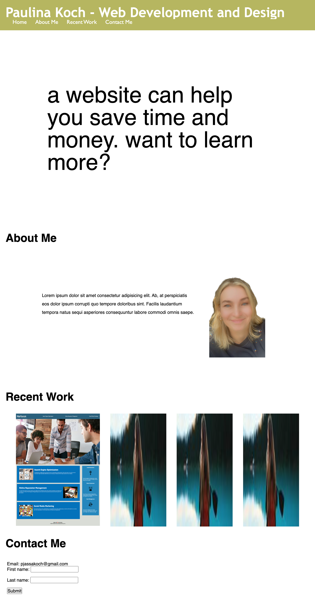

# Professional_Portfolio
My first professional portfolio
# <Your-Project-Title>

## Description

I'm creating a first professional profile website so that I can gain an online presence and showcase my skills, experience and my recent work and a way to contact me.  This will help me for getting in touch with potential employers or clients. It includes sections about me, a recent work portfolio, although there's only one so far and the rest are placeholder images. It also includes a contact me section.

## Table of Contents (Optional)

If your README is long, add a table of contents to make it easy for users to find what they need.

- [Installation](#installation)
- [Usage](#usage)
- [Credits](#credits)
- [License](#license)

## Installation

n/a

## Usage

    
    
    

## Credits

Paulina Koch and instructors that I asksed during office hours

## License

MIT [https://choosealicense.com/](https://choosealicense.com/).
